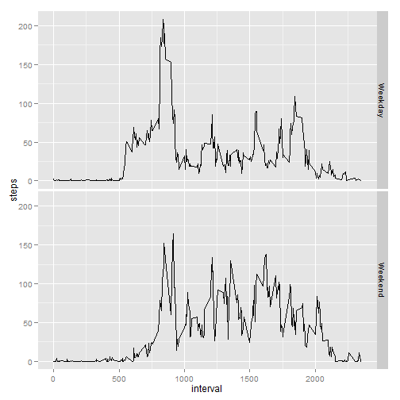

# Reproducible Research: Peer Assessment 1

## Loading and preprocessing the data

```r
#Unzip file repdata-data-activity.zip
activity <- read.csv("activity.csv", header=TRUE, na.strings="NA")
```

## What is mean total number of steps taken per day?

```r
library(ggplot2)

df <- aggregate(steps ~ date, data=activity, FUN=sum, na.rm=TRUE)
#plot summary of daily steps
ggplot(data=df, aes(steps)) + geom_histogram(binwidth=5000)
```

 

```r
activity.average <- aggregate(steps ~ date, data=activity, FUN=mean, na.rm=TRUE)
activity.median <- aggregate(steps ~ date, data=activity, FUN=median, na.rm=TRUE)

activity.average
```

```
##          date   steps
## 1  2012-10-02  0.4375
## 2  2012-10-03 39.4167
## 3  2012-10-04 42.0694
## 4  2012-10-05 46.1597
## 5  2012-10-06 53.5417
## 6  2012-10-07 38.2465
## 7  2012-10-09 44.4826
## 8  2012-10-10 34.3750
## 9  2012-10-11 35.7778
## 10 2012-10-12 60.3542
## 11 2012-10-13 43.1458
## 12 2012-10-14 52.4236
## 13 2012-10-15 35.2049
## 14 2012-10-16 52.3750
## 15 2012-10-17 46.7083
## 16 2012-10-18 34.9167
## 17 2012-10-19 41.0729
## 18 2012-10-20 36.0938
## 19 2012-10-21 30.6285
## 20 2012-10-22 46.7361
## 21 2012-10-23 30.9653
## 22 2012-10-24 29.0104
## 23 2012-10-25  8.6528
## 24 2012-10-26 23.5347
## 25 2012-10-27 35.1354
## 26 2012-10-28 39.7847
## 27 2012-10-29 17.4236
## 28 2012-10-30 34.0938
## 29 2012-10-31 53.5208
## 30 2012-11-02 36.8056
## 31 2012-11-03 36.7049
## 32 2012-11-05 36.2465
## 33 2012-11-06 28.9375
## 34 2012-11-07 44.7326
## 35 2012-11-08 11.1771
## 36 2012-11-11 43.7778
## 37 2012-11-12 37.3785
## 38 2012-11-13 25.4722
## 39 2012-11-15  0.1424
## 40 2012-11-16 18.8924
## 41 2012-11-17 49.7882
## 42 2012-11-18 52.4653
## 43 2012-11-19 30.6979
## 44 2012-11-20 15.5278
## 45 2012-11-21 44.3993
## 46 2012-11-22 70.9271
## 47 2012-11-23 73.5903
## 48 2012-11-24 50.2708
## 49 2012-11-25 41.0903
## 50 2012-11-26 38.7569
## 51 2012-11-27 47.3819
## 52 2012-11-28 35.3576
## 53 2012-11-29 24.4688
```

```r
activity.median
```

```
##          date steps
## 1  2012-10-02     0
## 2  2012-10-03     0
## 3  2012-10-04     0
## 4  2012-10-05     0
## 5  2012-10-06     0
## 6  2012-10-07     0
## 7  2012-10-09     0
## 8  2012-10-10     0
## 9  2012-10-11     0
## 10 2012-10-12     0
## 11 2012-10-13     0
## 12 2012-10-14     0
## 13 2012-10-15     0
## 14 2012-10-16     0
## 15 2012-10-17     0
## 16 2012-10-18     0
## 17 2012-10-19     0
## 18 2012-10-20     0
## 19 2012-10-21     0
## 20 2012-10-22     0
## 21 2012-10-23     0
## 22 2012-10-24     0
## 23 2012-10-25     0
## 24 2012-10-26     0
## 25 2012-10-27     0
## 26 2012-10-28     0
## 27 2012-10-29     0
## 28 2012-10-30     0
## 29 2012-10-31     0
## 30 2012-11-02     0
## 31 2012-11-03     0
## 32 2012-11-05     0
## 33 2012-11-06     0
## 34 2012-11-07     0
## 35 2012-11-08     0
## 36 2012-11-11     0
## 37 2012-11-12     0
## 38 2012-11-13     0
## 39 2012-11-15     0
## 40 2012-11-16     0
## 41 2012-11-17     0
## 42 2012-11-18     0
## 43 2012-11-19     0
## 44 2012-11-20     0
## 45 2012-11-21     0
## 46 2012-11-22     0
## 47 2012-11-23     0
## 48 2012-11-24     0
## 49 2012-11-25     0
## 50 2012-11-26     0
## 51 2012-11-27     0
## 52 2012-11-28     0
## 53 2012-11-29     0
```


## What is the average daily activity pattern?

```r
df <- aggregate(steps ~ interval, data=activity, mean)
ggplot(df, aes(steps, interval)) + geom_line()
```

 

```r
maxSteps <- df[which.max(df$steps), ]$interval
```
The maximum number of steps is 835


## Imputing missing values

```r
summary(activity)
```

```
##      steps               date          interval   
##  Min.   :  0.0   2012-10-01:  288   Min.   :   0  
##  1st Qu.:  0.0   2012-10-02:  288   1st Qu.: 589  
##  Median :  0.0   2012-10-03:  288   Median :1178  
##  Mean   : 37.4   2012-10-04:  288   Mean   :1178  
##  3rd Qu.: 12.0   2012-10-05:  288   3rd Qu.:1766  
##  Max.   :806.0   2012-10-06:  288   Max.   :2355  
##  NA's   :2304    (Other)   :15840
```

```r
missingCount <- nrow(activity[is.na(activity$steps), ])
print(paste('The number of missing step values is ', missingCount))
```

```
## [1] "The number of missing step values is  2304"
```

I plan to use the weekday and Interval as the basis for imputing missing step values.
The median of step using the combination of interval and weekday (df) was created to act as a lookup.
For all values of NA in the activity data set a lookup of interval and weekday is done on the df data frame for the median values of step


```r
#copy activity into new dataset
newActivity <- activity
#create new column for weekday
newActivity$weekday <- weekdays(as.Date(newActivity$date))

df <- aggregate(steps ~ interval + weekday, data=newActivity, FUN=median, na.rm=TRUE)

for(i in 1:nrow(newActivity))
{
  if(is.na(newActivity[i, 1]))
  {
    Interval <- newActivity[i, 3]
    Weekday <- newActivity[i, 4]

    # lookup values of interval and weekday in df and replace NA with the resulting step value
    newActivity[i, 1] <- df[df$interval == Interval & df$weekday == Weekday, ]$steps
  }
}

summary(newActivity)
```

```
##      steps               date          interval      weekday         
##  Min.   :  0.0   2012-10-01:  288   Min.   :   0   Length:17568      
##  1st Qu.:  0.0   2012-10-02:  288   1st Qu.: 589   Class :character  
##  Median :  0.0   2012-10-03:  288   Median :1178   Mode  :character  
##  Mean   : 33.7   2012-10-04:  288   Mean   :1178                     
##  3rd Qu.:  9.0   2012-10-05:  288   3rd Qu.:1766                     
##  Max.   :806.0   2012-10-06:  288   Max.   :2355                     
##                  (Other)   :15840
```

```r
df <- aggregate(steps ~ date + weekday, data=newActivity, FUN=sum, na.rm=TRUE)
#plot summary of daily steps with imputed values
ggplot(data=df, aes(steps)) + geom_histogram(binwidth=5000)
```

 

```r
newActivity.average <- aggregate(steps ~ date, data=newActivity, FUN=mean, na.rm=TRUE)
newActivity.median <- aggregate(steps ~ date, data=newActivity, FUN=median, na.rm=TRUE)

newActivity.average
```

```
##          date   steps
## 1  2012-10-01  7.1979
## 2  2012-10-02  0.4375
## 3  2012-10-03 39.4167
## 4  2012-10-04 42.0694
## 5  2012-10-05 46.1597
## 6  2012-10-06 53.5417
## 7  2012-10-07 38.2465
## 8  2012-10-08  7.1979
## 9  2012-10-09 44.4826
## 10 2012-10-10 34.3750
## 11 2012-10-11 35.7778
## 12 2012-10-12 60.3542
## 13 2012-10-13 43.1458
## 14 2012-10-14 52.4236
## 15 2012-10-15 35.2049
## 16 2012-10-16 52.3750
## 17 2012-10-17 46.7083
## 18 2012-10-18 34.9167
## 19 2012-10-19 41.0729
## 20 2012-10-20 36.0938
## 21 2012-10-21 30.6285
## 22 2012-10-22 46.7361
## 23 2012-10-23 30.9653
## 24 2012-10-24 29.0104
## 25 2012-10-25  8.6528
## 26 2012-10-26 23.5347
## 27 2012-10-27 35.1354
## 28 2012-10-28 39.7847
## 29 2012-10-29 17.4236
## 30 2012-10-30 34.0938
## 31 2012-10-31 53.5208
## 32 2012-11-01  7.5972
## 33 2012-11-02 36.8056
## 34 2012-11-03 36.7049
## 35 2012-11-04  9.4549
## 36 2012-11-05 36.2465
## 37 2012-11-06 28.9375
## 38 2012-11-07 44.7326
## 39 2012-11-08 11.1771
## 40 2012-11-09  9.9688
## 41 2012-11-10 12.7569
## 42 2012-11-11 43.7778
## 43 2012-11-12 37.3785
## 44 2012-11-13 25.4722
## 45 2012-11-14 10.2031
## 46 2012-11-15  0.1424
## 47 2012-11-16 18.8924
## 48 2012-11-17 49.7882
## 49 2012-11-18 52.4653
## 50 2012-11-19 30.6979
## 51 2012-11-20 15.5278
## 52 2012-11-21 44.3993
## 53 2012-11-22 70.9271
## 54 2012-11-23 73.5903
## 55 2012-11-24 50.2708
## 56 2012-11-25 41.0903
## 57 2012-11-26 38.7569
## 58 2012-11-27 47.3819
## 59 2012-11-28 35.3576
## 60 2012-11-29 24.4688
## 61 2012-11-30  9.9688
```

```r
newActivity.median
```

```
##          date steps
## 1  2012-10-01     0
## 2  2012-10-02     0
## 3  2012-10-03     0
## 4  2012-10-04     0
## 5  2012-10-05     0
## 6  2012-10-06     0
## 7  2012-10-07     0
## 8  2012-10-08     0
## 9  2012-10-09     0
## 10 2012-10-10     0
## 11 2012-10-11     0
## 12 2012-10-12     0
## 13 2012-10-13     0
## 14 2012-10-14     0
## 15 2012-10-15     0
## 16 2012-10-16     0
## 17 2012-10-17     0
## 18 2012-10-18     0
## 19 2012-10-19     0
## 20 2012-10-20     0
## 21 2012-10-21     0
## 22 2012-10-22     0
## 23 2012-10-23     0
## 24 2012-10-24     0
## 25 2012-10-25     0
## 26 2012-10-26     0
## 27 2012-10-27     0
## 28 2012-10-28     0
## 29 2012-10-29     0
## 30 2012-10-30     0
## 31 2012-10-31     0
## 32 2012-11-01     0
## 33 2012-11-02     0
## 34 2012-11-03     0
## 35 2012-11-04     0
## 36 2012-11-05     0
## 37 2012-11-06     0
## 38 2012-11-07     0
## 39 2012-11-08     0
## 40 2012-11-09     0
## 41 2012-11-10     0
## 42 2012-11-11     0
## 43 2012-11-12     0
## 44 2012-11-13     0
## 45 2012-11-14     0
## 46 2012-11-15     0
## 47 2012-11-16     0
## 48 2012-11-17     0
## 49 2012-11-18     0
## 50 2012-11-19     0
## 51 2012-11-20     0
## 52 2012-11-21     0
## 53 2012-11-22     0
## 54 2012-11-23     0
## 55 2012-11-24     0
## 56 2012-11-25     0
## 57 2012-11-26     0
## 58 2012-11-27     0
## 59 2012-11-28     0
## 60 2012-11-29     0
## 61 2012-11-30     0
```


## Are there differences in activity patterns between weekdays and weekends?


```r
newActivity$weekdaytype <- newActivity$weekday %in% c("Monday", "Tuesday", "Wednesday", "Thursday", "Friday")
newActivity[newActivity$weekdaytype == TRUE, ]$weekdaytype <- 'Weekday'
newActivity[newActivity$weekdaytype == FALSE, ]$weekdaytype <- 'Weekend'

newActivity$weekdaytype <- factor(newActivity$weekdaytype)

df <- aggregate(steps ~ weekdaytype + interval, data=newActivity, mean, na.rm=TRUE)
ggplot(df, aes(steps, interval)) + geom_line() + facet_grid(weekdaytype ~ .)
```

 
